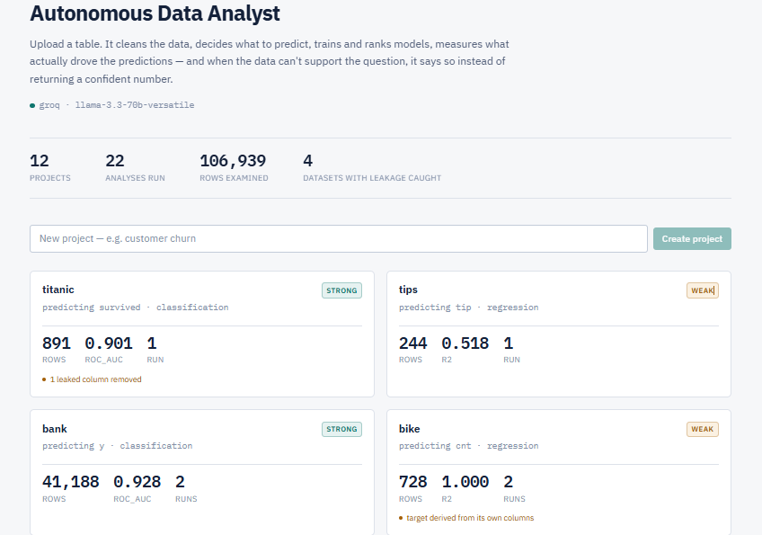
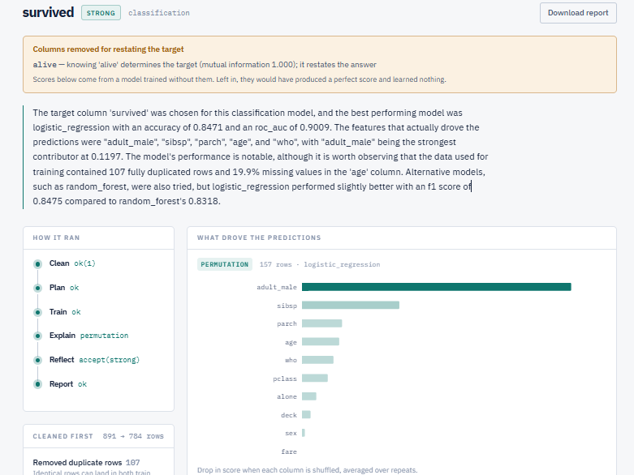
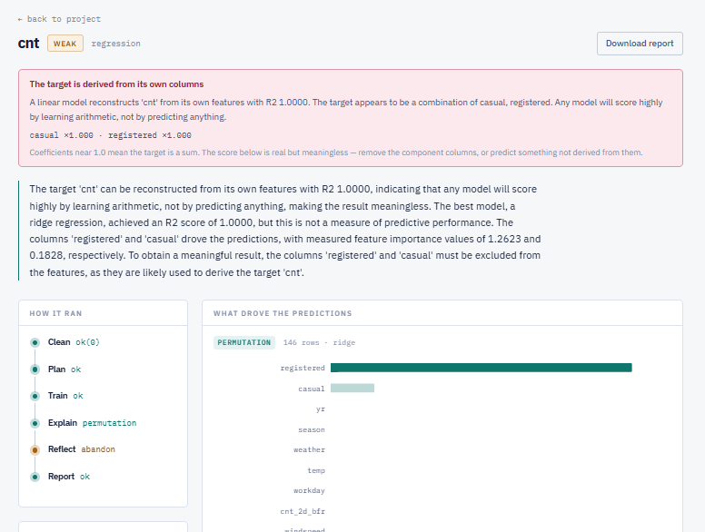
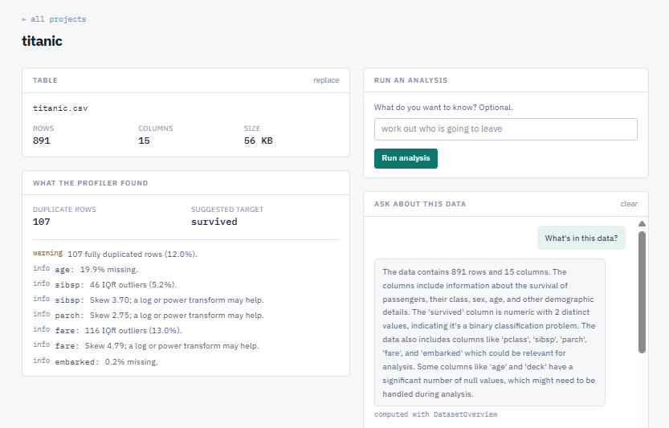

# DATA INTELLIGENCE OS

**An evidence-led data analysis workspace that profiles a dataset, trains and evaluates a model, and makes the limits of its conclusions visible.**


> **Project Overview**
>
> Data Intelligence OS is a comprehensive capstone project that provides an advanced,
> evidence-led data analysis workspace. It features a custom Data Health Engine,
> an interactive AI Analysis Trace, a saved-model What-if Scenario Engine, and a
> robust Decision Intelligence Dashboard to help users make informed data-driven decisions.

[Demo](#) · [Walkthrough](#)

## Problem Statement

Automated modelling can produce confident scores even when a dataset contains
missing values, duplicates, leakage, weak predictive signal, or too few useful
features. Data Intelligence OS combines deterministic measurements, model
quality checks, and bounded AI interpretation so users can inspect evidence
before treating a prediction as decision support.

## Project Overview

Upload a CSV/TSV, inspect its profile and Data Health Score, run a model-backed
analysis, review the recorded pipeline and measured feature importance, ask
tool-grounded questions, and test a what-if change with the saved model. The
Decision Intelligence view brings the current run's evidence and scenario result
together and separates calculated values from AI interpretation.

## Key Features

- Deterministic cleaning and profiling, including null rates, duplicates,
  semantic types, correlations, outliers, and target candidates.
- Data Health Score for completeness, validity, uniqueness, and consistency.
- AI-planned model analysis with bounded reflection/retries, quality gates,
  saved model artifacts, and SHAP or permutation feature importance.
- AI Analysis Trace rendered from the pipeline events recorded for the run.
- Interactive AI Q&A using schema-validated tools that compute values from the
  selected dataset.
- What-if scenarios that apply a requested feature change to a copy of the
  dataset and compare predictions from the run's saved model.
- Decision Intelligence that assembles run metrics, health, feature evidence,
  risk checks, and the current scenario result without creating replacement
  predictions.
- Executive PDF generation for completed analysis runs.

## Screenshots

The repository includes these existing product screenshots:









Screenshots of the customized Data Health, What-if, and Decision Intelligence
views should be refreshed from this repository before publishing a final
portfolio gallery.

> The live demo runs on free hosting: the backend sleeps after 15 minutes of
> inactivity, so the first request can take 30–60 seconds to wake it. The
> database starts empty — upload the sample CSV in `sample_data/`, or your
> own, to see it run.

Upload a table. It cleans the data, profiles it, decides what to predict, trains
and ranks models, measures what actually drove the predictions, judges its own
output against thresholds, and — when the data can't support the question —
says so instead of shipping a confident answer.

That last part is the point. Most AutoML demos always produce a result. This
one tells you your data isn't good enough, and shows you why.

---

## Tested against real data

Nine public datasets. Five classes of silent failure found and fixed — each
needing a different check, none catchable by unit tests alone:

| Finding | What exposed it |
|---|---|
| A column restating the target — Titanic's `alive`, producing a perfect and meaningless score | Per-feature mutual information |
| A target summing its own features — bike sharing, where cnt = casual + registered gives R² 1.0000 |
| Missingness misattributed to a column's value — planets, where `mass` is 99.7% absent for one class and 7.8% for another | Explicit missingness indicators |
| Attribution lost in report formatting, reversing a fix one layer downstream | Reading the output |
| Cleaning assuming a comma delimiter, destroying semicolon-separated files before training saw them | Trying a dataset that wasn't comma-delimited |

Each is documented in [`docs/PHASE_NOTES.md`](docs/PHASE_NOTES.md) with the
measurement that prompted it. The habit that found all five: **treat a high
score as a hypothesis about the data, not a result.**

Titanic contains `survived` and `alive` — the same fact twice. Left alone, the
model scores a perfect 1.000 and has learned nothing. Here it is caught,
removed, and the honest result reported instead:


The bike sharing dataset is sharper still. `cnt` is literally `casual +
registered`, so a linear model reconstructs it exactly. The system reports
R² **1.0000** — and refuses to endorse it:


---

## Data Processing and Analysis Workflow

```
CSV ──► Clean ──► Profile ──► Plan ──► Train ──► Explain ──► Reflect ──► Report
       (no LLM)  (no LLM)    (LLM)   (no LLM)   (no LLM)     (LLM)      (LLM)
                                        ▲                       │
                                        └───────── retry ───────┘
```

**Clean** — trims whitespace so `' Male'` and `'Male'` are one category,
converts placeholder text (`N/A`, `unknown`, `-`, `?`) to real nulls, drops
empty columns and exact duplicates. Duplicates matter: identical rows can land
in both train and test, quietly overstating every score. The original upload is
never modified.

**Profile** — deterministic statistics: semantic column types, null rates,
cardinality, IQR outliers, skew, correlations, quality warnings, and a ranked
shortlist of plausible targets. No model involved, so it's reproducible and
costs nothing.

**Plan** — an LLM reads the profile and chooses a target and task type. Its
choice is validated against the real column list; a hallucinated column falls
back to the deterministic shortlist rather than failing the run.

**Train** — scikit-learn pipelines with per-type imputation, scaling and
one-hot encoding. Identifier, constant and free-text columns are excluded with
reasons recorded. Before training, two leakage checks run: mutual information
catches a column that restates the target, and linear reconstruction catches a
target that sums its own features.

**Explain** — SHAP `TreeExplainer` for ensembles, permutation importance
otherwise, with the row count budgeted against model size so a large forest
can't block for minutes. One-hot columns fold back to their source column,
because a reader wants to know `contract` mattered, not
`cat__contract_Two year`. Missingness indicators deliberately stay separate.

**Reflect** — thresholds, not an LLM, decide whether a result is weak. Only
then is a model asked what to do about it, and it may drop inert features,
change target, or abandon. The retry loop is bounded three independent ways.

**Report** — a plain-language summary grounded in measured importances and
explicitly forbidden from speculating about causes, plus an executive PDF that
states the verdict before any number.

You can also **ask questions about the data**. The chat agent has seven
schema-validated tools and chooses which to call. There is deliberately no
"run this code" tool, and every answer shows which tools produced it.


A generated report is included at
[`docs/sample-report.pdf`](docs/sample-report.pdf) — the Titanic run, verdict
first.

---

## Data Intelligence OS Extensions

These extensions build on the upstream pipeline and reuse its dataset profiles,
analysis runs, model artifacts, and API wherever possible.

### Data Health

`backend/app/services/data_health.py` calculates a deterministic score from the
saved profile: completeness, validity, uniqueness, and consistency. The dataset
API exposes it at `/api/v1/projects/{project_id}/datasets/{dataset_id}/health`,
and the run page displays the calculated score and findings. It is a quality
heuristic, not a guarantee that a model is useful for a business decision.

### AI Analysis Trace

The analysis graph records stage events such as `clean:ok`, `training:ok(r0)`,
and `explain:shap` in the run output. The trace UI renders those recorded events
and their run-specific evidence; it is not a live progress stream.

### Interactive AI Q&A

The chat agent uses a fixed, schema-validated tool set to compute answers from
the selected dataset and, where relevant, the latest analysis for that dataset.
The LLM chooses tools and explains their measured output; it cannot execute
arbitrary code. Chat history is stored per project.

### What-if Scenario Engine

The scenario endpoint reuses a successfully completed run's saved model and
linked dataset. It applies a feature operation to a copy, predicts baseline and
scenario outcomes on the same evaluated rows, and returns the measured change,
scope, and an evidence-limited AI explanation. The latest completed scenario is
stored in the existing run output and included in PDFs generated afterward.
Supported operations include percentage increase/decrease, set, add, subtract,
multiply, and divide. Results describe model sensitivity, not causal effects;
only the latest scenario is retained for a run.

### Decision Intelligence Dashboard

After a scenario runs, the frontend composes a decision view from that run's
analysis output, Data Health response, quality checks, model metrics, feature
importance, and scenario result. Calculated facts are labeled separately from
the AI interpretation and recommendation. It does not create a second model or
invent an operational/business impact.

### PDF Report

The report includes the completed run's summary, verdict and quality checks,
feature importance, cleaning details, training information, model comparison,
retries, analysis limits, and the latest saved What-if scenario. If no scenario
has been run, the report says so. Data Health and the full Decision Intelligence
dashboard view are not embedded in the PDF.

## System Architecture

See [the architecture document](docs/ARCHITECTURE.md) for the user workflow,
actual API/data paths, analysis graph, persistence boundaries, and supporting
infrastructure. In particular, Q&A and What-if are separate API requests, not
nodes in the LangGraph analysis run.

---

## Installation and Docker Setup

Requirements: Docker Compose and either a Google/Groq API key or a reachable
local Ollama server.

```bash
git clone https://github.com/anuragbishit/Data-Intelligence-OS.git
cd Data-Intelligence-OS
test -f .env || cp .env.example .env
# Edit .env and set the key for the selected LLM_PROVIDER.
docker compose up -d --build
```

The API container applies Alembic migrations before starting FastAPI. To check
or re-apply the current migration head manually, run
`docker compose exec api alembic current` or `docker compose exec api alembic upgrade head`.

Open the app at **http://localhost:5173**. The API is at **http://localhost:8000**;
FastAPI docs are available at `/docs` while `DEBUG=true`.

PowerShell setup:

```powershell
if (!(Test-Path .env)) { Copy-Item .env.example .env }
docker compose up -d --build
```

If `.env` already exists, keep it and update only the variables you need.

## Environment Variables

Set secrets only in the local `.env`; it is ignored by Git. Never put provider
keys in frontend variables or commit them.

| Variable | Purpose |
|---|---|
| `LLM_PROVIDER` | `google`, `groq`, or `ollama` |
| `GOOGLE_API_KEY`, `GOOGLE_MODEL` | Google provider credentials/model |
| `GROQ_API_KEY`, `GROQ_MODEL` | Groq provider credentials/model |
| `OLLAMA_BASE_URL`, `OLLAMA_MODEL` | Local Ollama endpoint/model |
| `LLM_TEMPERATURE`, `LLM_MAX_RETRIES` | LLM request behavior |
| `LANGSMITH_TRACING`, `LANGSMITH_API_KEY`, `LANGSMITH_PROJECT` | Optional tracing configuration |
| `POSTGRES_USER`, `POSTGRES_PASSWORD`, `POSTGRES_DB`, `POSTGRES_HOST`, `POSTGRES_PORT` | PostgreSQL connection settings |
| `REDIS_HOST`, `REDIS_PORT`, `REDIS_DB` | Redis readiness-check connection |
| `STORAGE_DIR`, `MAX_UPLOAD_MB` | File storage and upload cap (default 250 MB) |
| `ENVIRONMENT`, `DEBUG`, `API_V1_PREFIX`, `APP_NAME` | Application behavior and API configuration |
| `DB_SSL`, `CORS_ORIGINS` | Database TLS and allowed browser origins |
| `VITE_API_BASE` | Optional frontend API base prefix; defaults to same-origin `/api/v1` |

`.env.example` contains development defaults and blank provider-key fields, not
credentials. Replace default database credentials before using the stack on a
network. `DEMO_UPLOAD_TOKEN` is defined as a configuration/helper hook but is
not currently attached to the upload route.

## Example Workflow

1. Create a project and upload `sample_data/customers.csv` or
  `sample_data/retail_orders.csv`.
2. Review profiling warnings and the Data Health Score.
3. Run an analysis; inspect its target, quality checks, model comparison,
  feature importance, and recorded AI Analysis Trace.
4. Ask a dataset question in the run-page Q&A and inspect the tool attribution.
5. Run a What-if scenario using a feature used by the saved model. Review the
  baseline/scenario comparison and the Decision Intelligence evidence/risk.
6. Download the PDF report for the completed analysis. It includes the latest
  What-if result if one has been run; otherwise it states that no scenario was
  run for that analysis.

## API Overview

All routes use the `/api/v1` prefix. Important endpoints:

| Method | Endpoint | Purpose |
|---|---|---|
| `GET` | `/health`, `/ready`, `/llm/check` | Liveness, dependency readiness, and provider check |
| `GET`, `POST` | `/projects` | List or create projects |
| `GET` | `/projects/{project_id}` | Read one project |
| `GET`, `POST` | `/projects/{project_id}/datasets` | List or upload datasets |
| `GET` | `/projects/{project_id}/datasets/{dataset_id}/profile` | Read the stored profile |
| `GET` | `/projects/{project_id}/datasets/{dataset_id}/health` | Calculate Data Health from the profile |
| `POST` | `/projects/{project_id}/analysis` | Run analysis for a dataset |
| `GET` | `/projects/{project_id}/analysis`, `/analysis/{run_id}` | List runs or read a run |
| `POST` | `/analysis/{run_id}/scenarios` | Run a saved-model What-if scenario |
| `GET` | `/analysis/{run_id}/report.pdf` | Generate/download the run PDF |
| `GET`, `POST`, `DELETE` | `/projects/{project_id}/chat` | Read, ask, or clear project chat history |

## Testing

Run the backend suite (231 tests at the time of this documentation update):

```bash
docker compose exec api pytest -q
```

Build/type-check the frontend:

```bash
cd frontend
npm ci
npm run build
```

The backend tests use stub LLMs and do not require a provider key. The live
`/api/v1/llm/check` endpoint verifies the configured provider separately.

---

## Design decisions

**Deterministic layers produce measurements; LLM layers produce judgements.**
Cleaning, profiling, Data Health, training, scenario prediction, and quality
assessment are deterministic Python. The planner proposes what to predict;
quality thresholds determine whether the result is trustworthy; reflection may
propose a bounded retry; and LLM prose explains measured facts. Proposed plan
and reflection values are validated before they can affect the pipeline.

**No test makes a provider network call.** The 231-test suite runs with LLMs
stubbed. Runtime LLM calls are bounded by the analysis/tool workflows, while
prompt size can vary with the profile, run evidence, and question.

**Every model suggestion is validated before use.** Target columns are checked
against the real schema, proposed exclusions are filtered to columns that
exist, and a revision that would drop every remaining feature is refused. Each
guard has a test that feeds it a deliberately bad suggestion — including one
that hands the chat agent a call to `ExecutePython` with `rm -rf /` and asserts
the dispatcher refuses it.

**The retry loop is bounded three independent ways:** a hard round cap, a
required improvement margin on the *gating* metric, and detection of retries
that change nothing. An unbounded loop is the characteristic failure of agentic
systems, so it's the most heavily tested part of the codebase.

**Grounding beats prohibition.** Early versions invented causes — claiming
missing values had "hindered predictive ability" when the column was noise, or
that 482 rows was "too small" when the sample-size check had passed. Telling
the model not to speculate did not work. Handing it the specific facts it was
speculating about — measured importances, and the list of checks that *passed*
— did.

**No DataFrames in graph state.** LangGraph checkpoints state on every
transition. Datasets and fitted models live on disk; state carries IDs and
paths. The explain step reconstructs its train/test split from a fixed seed
rather than receiving it.

---

## Technology Stack

| Layer | Choice |
|---|---|
| API | FastAPI, Pydantic, async SQLAlchemy 2.0, Alembic |
| Agents | LangGraph, LangChain provider integrations, optional LangSmith tracing |
| LLM | Gemini, Groq, or local Ollama — selected with `LLM_PROVIDER` |
| ML | scikit-learn, SHAP |
| Data | pandas, NumPy, PostgreSQL 16, Redis 7 (readiness check) |
| Reporting | ReportLab; pypdf for PDF tests |
| UI | React 18, TypeScript, Tailwind v4, Recharts |
| Infra | Docker Compose, GitHub Actions |

Cleaning, profiling, quality assessment, training, scenario predictions, and
Data Health calculations are deterministic Python. LLM calls provide bounded
planning, reflection, summary, Q&A, and evidence-limited scenario interpretation.
Redis is currently checked by readiness and is not a job queue.

---

## Project Structure

```
backend/
  app/
    core/          configuration, logging, LLM provider setup
    db/            SQLAlchemy models and async database session
    schemas/       API request/response schemas, including scenarios
    api/routes/    analysis, chat, datasets, health, projects
    agents/        LangGraph nodes/graph, chat agent, state
    services/      analysis, artifacts, chat, chat_tools, cleaning, datasets,
                   data_health, explain, profiling, projects, quality,
                   report, scenarios, storage, training
  alembic/          database migrations
  tests/            API, agent, service, report, and scenario tests
frontend/src/
  api.ts           typed API client
  components/      AIAnalysisTrace, Chat, DataHealthScore,
                   DecisionIntelligenceDashboard, WhatIfScenario,
                   ImportanceChart, RunTrace, Verdict, shared shell
  pages/           Projects, ProjectDetail, RunDetail
docs/               ARCHITECTURE.md, PHASE_NOTES.md, screenshots, sample PDF
sample_data/        customers.csv, retail_orders.csv
storage/            local uploads, cleaned files, models, reports
docker-compose.yml  local PostgreSQL, Redis, API, and web services
.github/workflows/  CI workflow
```

---

## Limitations

Stated plainly, because a limitation you find that I haven't named should make
you trust the rest less.

- **Large-file limits are 250 MB and 500,000 rows.** Profiling and training
  read at most 500,000 rows; training samples at most 20,000 for an interactive
  run. Cleaning still loads the full CSV into memory, so available RAM remains
  the practical limit. Analysis is synchronous; a background worker and
  streaming cleaning are needed for substantially larger workloads.
- **Only the latest What-if result is retained per run.** A later scenario
  replaces the previous reportable result; scenario history is not stored.
- **Decision Intelligence is a run-page composition.** It combines the current
  run, Data Health, model evidence, and current scenario response; there is no
  separate persisted decision record.
- **Authentication is not implemented.** Development routes use one local
  user (`api/deps.get_current_user`); `ENVIRONMENT=production` deliberately
  refuses requests rather than granting access. Do not expose this configuration
  as a public production service.
- **Redis is not a worker or queue.** It is checked by `/api/v1/ready`; analysis
  remains synchronous and graph checkpoints use in-memory `MemorySaver`.
- **Skewed targets aren't transformed.** Predicting a variable spanning five
  orders of magnitude (planets' `orbital_period`) gives a poor R². The profiler
  detects the skew; nothing acts on it.
- **Collinear features split importance unpredictably.** On diamonds, `y`
  outranked `carat` and `x` was reported as inert though all three measure size.
  On Titanic, `sex` looks unimportant because `adult_male` already encodes it.
  The profiler detects the collinearity; the explanation doesn't group by it.
- **Datetime columns are dropped rather than engineered.**
- **Reflection can exclude most features**, leaving a near-degenerate model. It
  refuses to exclude *all* of them; that's the only guard.
- **Temporal leakage can't be detected.** A feature recorded *after* the
  outcome — bank marketing's `duration`, known only once a call has ended — is
  statistically indistinguishable from a good predictor. The system surfaces
  dominant features so a human can recognise it.

---

## Future Improvements

- Add real authentication and authorization before public hosting.
- Move uploads, profiling, analysis, and scenario evaluation to bounded
  background jobs; stream or chunk large-file cleaning.
- Persist What-if requests/results and extend the PDF with Data Health and
  Decision Intelligence evidence.
- Add temporal validation and stronger causal/experimental evaluation so model
  sensitivity is not mistaken for the effect of a real-world intervention.
- Add durable graph checkpointing if resumable analysis becomes necessary.
- Build a production frontend image and add API/web container healthchecks when
  moving beyond local Docker development.

---

## License

Copyright (c) 2026 anuragbishit.

This repository is licensed under the [MIT License](LICENSE).
The project includes capabilities and extensions unique to Data Intelligence OS,
which are distinguished in the [Key Features](#key-features) section above.

---

## Notes

[`docs/ARCHITECTURE.md`](docs/ARCHITECTURE.md) covers the graph, the layer
boundaries and the failure policy per node.

[`docs/PHASE_NOTES.md`](docs/PHASE_NOTES.md) records the reasoning behind each
decision and the bugs that shaped it — including the async lazy-load that only
appeared through the HTTP layer, the pandas 3.0 dtype change that made cleaning
silently do nothing, the SHAP call that would have run for fifteen minutes and
taken the whole API offline with it, and the gate metric that disagreed with
the stop condition for two full rounds before anyone noticed.
